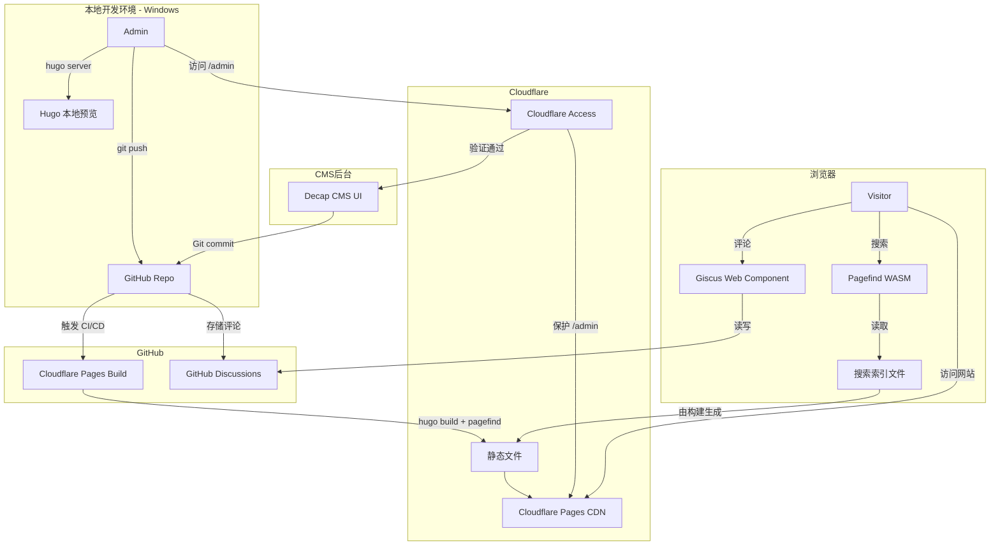

# 技术设计文档：电影博客网站

## 概述

本项目是一个基于 Hugo 的个人电影博客静态网站，托管于 Cloudflare Pages，通过 GitHub 进行版本管理与 CI/CD 自动部署。内容管理通过 Decap CMS 提供可视化后台，由 Cloudflare Access 保护访问权限。站内搜索采用 Pagefind（构建时生成 WebAssembly 索引），评论功能通过 Giscus 集成 GitHub Discussions 实现。整个系统无需独立服务器，完全运行在免费套餐范围内。

### 技术选型总结

| 组件 | 技术方案 | 理由 |
|------|----------|------|
| 静态站点生成器 | Hugo | 单一 .exe 二进制，Windows 友好，构建速度快 |
| 托管平台 | Cloudflare Pages | 免费套餐，全球 CDN，自动 CI/CD |
| 版本管理 | GitHub | Decap CMS 依赖 Git 后端，Giscus 依赖 Discussions |
| CMS | Decap CMS | 开源，Git-based，无需独立后端 |
| CMS 身份验证 | Cloudflare Access | 零信任访问控制，保护 /admin 路径 |
| 站内搜索 | Pagefind | 构建时生成索引，WebAssembly 运行，无需后端 |
| 评论 | Giscus | 基于 GitHub Discussions，免费，无需独立服务器 |

---

## 架构

### 整体架构图



### 数据流说明

1. **内容发布流程**：Admin 在 Decap CMS 编辑文章 → CMS 提交 Markdown 到 GitHub → Cloudflare Pages 触发构建 → Hugo 编译 HTML + Pagefind 生成索引 → 部署到 CDN
2. **访客浏览流程**：Visitor 访问 CDN → 获取静态 HTML/CSS/JS → Pagefind WASM 在客户端处理搜索 → Giscus 从 GitHub Discussions 加载评论
3. **后台保护流程**：请求 `/admin` → Cloudflare Access 拦截 → 身份验证（邮件 OTP 或 GitHub OAuth） → 验证通过后访问 Decap CMS

---

## 组件与接口

### 1. Hugo 站点结构

```
movie-blog/
├── hugo.toml                 # 主配置文件
├── content/
│   ├── posts/                # 文章 Markdown 文件
│   └── _index.md             # 首页内容
├── layouts/
│   ├── _default/
│   │   ├── baseof.html       # 基础模板
│   │   ├── single.html       # 文章详情页
│   │   └── list.html         # 列表页
│   ├── index.html            # 首页模板
│   └── 404.html              # 404 页面
├── static/
│   ├── admin/
│   │   ├── index.html        # Decap CMS 入口
│   │   └── config.yml        # Decap CMS 配置
│   └── images/               # 上传的图片
├── assets/
│   ├── css/                  # 样式文件
│   └── js/                   # 脚本文件
├── themes/                   # Hugo 主题（可选子模块）
└── public/                   # 构建输出目录（gitignore）
```

### 2. Decap CMS 配置接口

`static/admin/config.yml` 定义 CMS 的后端连接和内容集合：

```yaml
backend:
  name: github
  repo: <username>/<repo-name>
  branch: main

media_folder: static/images/uploads
public_folder: /images/uploads

collections:
  - name: posts
    label: 文章
    folder: content/posts
    create: true
    slug: "{{year}}-{{month}}-{{day}}-{{slug}}"
    fields:
      - { label: 标题, name: title, widget: string }
      - { label: 发布日期, name: date, widget: datetime }
      - { label: 草稿, name: draft, widget: boolean, default: false }
      - { label: 封面图片, name: cover, widget: image, required: false }
      - { label: 摘要, name: summary, widget: text, required: false }
      - { label: 分类, name: categories, widget: list, required: false }
      - { label: 标签, name: tags, widget: list, required: false }
      - { label: 电影名称, name: movie_title, widget: string, required: false }
      - { label: 导演, name: director, widget: string, required: false }
      - { label: 上映年份, name: release_year, widget: number, required: false }
      - { label: 评分, name: rating, widget: number, value_type: float, min: 0, max: 10, required: false }
      - { label: 正文, name: body, widget: markdown }
```

### 3. Cloudflare Pages 构建配置

在 Cloudflare Pages 控制台配置构建命令：

| 配置项 | 值 |
|--------|-----|
| 构建命令 | `hugo --minify && npx pagefind --site public` |
| 输出目录 | `public` |
| Hugo 版本 | 通过环境变量 `HUGO_VERSION` 指定（如 `0.128.0`） |
| Node.js 版本 | `18`（用于运行 Pagefind CLI） |

### 4. Pagefind 集成接口

构建后 Pagefind 在 `public/pagefind/` 目录生成索引文件。在 Hugo 模板中引入搜索 UI：

```html
<!-- layouts/partials/search.html -->
<link href="/pagefind/pagefind-ui.css" rel="stylesheet">
<div id="search"></div>
<script src="/pagefind/pagefind-ui.js"></script>
<script>
  window.addEventListener('DOMContentLoaded', () => {
    new PagefindUI({ element: "#search", showSubResults: true });
  });
</script>
```

### 5. Giscus 集成接口

在文章模板中嵌入 Giscus Web Component：

```html
<!-- layouts/partials/comments.html -->
<script src="https://giscus.app/client.js"
  data-repo="<username>/<repo>"
  data-repo-id="<repo-id>"
  data-category="Announcements"
  data-category-id="<category-id>"
  data-mapping="pathname"
  data-strict="0"
  data-reactions-enabled="1"
  data-emit-metadata="0"
  data-input-position="bottom"
  data-theme="preferred_color_scheme"
  data-lang="zh-CN"
  crossorigin="anonymous"
  async>
</script>
```

### 6. Cloudflare Access 配置

通过 Cloudflare Zero Trust 控制台配置：

- **应用类型**：Self-hosted
- **应用域名**：`<your-domain>/admin*`
- **策略**：允许特定邮箱地址（Admin 邮箱）通过 One-time PIN 验证
- **会话时长**：24 小时

---

## 数据模型

### Post（文章）Front Matter 结构

每篇文章为一个 Markdown 文件，Front Matter 采用 TOML 或 YAML 格式：

```yaml
---
title: "电影名称 - 影评标题"
date: 2024-01-15T10:00:00+08:00
draft: false
cover: "/images/uploads/movie-cover.jpg"
summary: "这是一篇关于某部电影的影评摘要..."
categories:
  - 影评
tags:
  - 科幻
  - 2024

# 电影元数据
movie_title: "某部电影"
director: "某导演"
release_year: 2024
rating: 8.5
---

正文内容...
```

### Hugo 配置文件结构（hugo.toml）

```toml
baseURL = "https://your-domain.pages.dev"
languageCode = "zh-CN"
title = "电影博客"
theme = "your-theme"

[params]
  description = "个人电影博客"
  giscus_repo = "<username>/<repo>"
  giscus_repo_id = "<repo-id>"
  giscus_category = "Announcements"
  giscus_category_id = "<category-id>"

[taxonomies]
  category = "categories"
  tag = "tags"

[outputs]
  home = ["HTML", "RSS"]
  section = ["HTML", "RSS"]

[markup.goldmark.renderer]
  unsafe = true
```

### 搜索索引数据结构（由 Pagefind 生成）

Pagefind 在构建时扫描 `public/` 目录下的 HTML 文件，自动提取：
- 页面标题（`<title>` 或 `data-pagefind-meta="title"` 属性）
- 正文内容（`data-pagefind-body` 标记的区域）
- 自定义元数据（通过 `data-pagefind-meta` 属性标记）

在文章模板中标记可索引区域：

```html
<article data-pagefind-body>
  <h1 data-pagefind-meta="title">{{ .Title }}</h1>
  {{ .Content }}
</article>
```

### 部署状态模型

| 状态 | 描述 |
|------|------|
| `building` | Cloudflare Pages 正在执行构建命令 |
| `success` | 构建成功，新版本已上线 |
| `failed` | 构建失败，保留上一次成功版本 |
| `draft` | 文章草稿，`draft: true`，构建时不输出 |

---

## 正确性属性

*属性（Property）是在系统所有有效执行中都应成立的特征或行为——本质上是对系统应该做什么的形式化陈述。属性是人类可读规范与机器可验证正确性保证之间的桥梁。*

### 属性 1：Markdown 到 HTML 的构建 Round-Trip

*对任意* 有效的 Markdown 文章文件（非草稿），执行 Hugo 构建后，`public/` 目录中应存在对应的 HTML 文件，且 HTML 文件包含原始 Markdown 的标题内容。

**验证需求：2.1**

---

### 属性 2：草稿文章不输出到构建结果

*对任意* `draft: true` 的文章，执行 Hugo 构建后，`public/` 目录中不应存在该文章对应的 HTML 文件。

**验证需求：3.7**

---

### 属性 3：文章字段完整渲染

*对任意* 包含标题、发布日期、封面图片、分类、标签以及电影元数据（电影名称、导演、上映年份、评分）的文章，Hugo 构建后生成的 HTML 应包含这些字段的渲染输出。

**验证需求：4.1, 4.2**

---

### 属性 4：首页完整展示非草稿文章信息

*对任意* 非草稿文章，Hugo 构建后首页 HTML（`public/index.html`）应包含该文章的标题链接、发布日期和摘要文本。

**验证需求：4.3, 5.2**

---

### 属性 5：分类与标签聚合页面生成

*对任意* 包含 `categories` 或 `tags` 字段的非草稿文章，Hugo 构建后应在 `public/categories/` 和 `public/tags/` 目录下生成对应的聚合页面，且该页面包含指向该文章的链接。

**验证需求：2.4, 4.4**

---

### 属性 6：文章永久链接唯一性

*对任意* 两篇不同的非草稿文章，Hugo 构建后它们在 `public/` 目录中生成的 HTML 文件路径应互不相同。

**验证需求：4.5**

---

### 属性 7：搜索索引覆盖文章内容

*对任意* 已构建并被 Pagefind 索引的文章，使用该文章标题中的关键词进行 Pagefind 搜索，应在结果中返回包含该文章 URL 的条目。

**验证需求：6.2, 6.3**

---

### 属性 8：Giscus 嵌入每篇文章页面

*对任意* 非草稿文章，Hugo 构建后生成的文章 HTML 应包含 Giscus 的 `<script>` 标签，且 `data-repo` 属性值与配置一致。

**验证需求：7.1**

---

### 属性 9：文章主体内容静态渲染

*对任意* 非草稿文章，Hugo 构建后生成的 HTML 中，文章标题和正文内容应直接存在于 HTML 源码中，不依赖 JavaScript 动态渲染（即在禁用 JS 的情况下内容仍可读取）。

**验证需求：7.4**

---

## 错误处理

### 构建失败处理

| 场景 | 处理方式 |
|------|----------|
| Hugo 构建命令返回非零退出码 | Cloudflare Pages 标记构建失败，保留上一次成功部署，Admin 收到邮件通知 |
| Pagefind 索引生成失败 | 构建脚本应将 Pagefind 错误传播为构建失败，避免部署无搜索功能的版本 |
| Front Matter 格式错误 | Hugo 构建时报错并指出问题文件，构建失败 |
| 图片引用路径不存在 | Hugo 默认忽略缺失图片，页面仍可构建，但封面图显示为空 |

### 访问控制错误处理

| 场景 | 处理方式 |
|------|----------|
| 未授权访问 `/admin` | Cloudflare Access 返回 403，重定向到身份验证页面 |
| Cloudflare Access 会话过期 | 重新触发身份验证流程 |

### 前端错误处理

| 场景 | 处理方式 |
|------|----------|
| Giscus 脚本加载失败 | 评论区域不显示，页面主体内容不受影响（属性 9 保证） |
| Pagefind WASM 加载失败 | 搜索框不可用，页面其他功能正常 |
| 访问不存在的页面 | 展示自定义 `404.html` 页面 |

---

## 测试策略

### 双轨测试方法

本项目采用**单元测试**和**属性测试**相结合的方式：

- **单元测试（示例测试）**：验证具体示例、边界条件和错误场景
- **属性测试（基于属性的测试）**：通过随机生成输入验证普遍性属性

两者互补，共同提供全面的正确性保证。

### 测试工具选型

由于 Hugo 是 Go 语言编写的工具，测试策略以**构建产物验证**为主：

| 测试类型 | 工具 | 说明 |
|----------|------|------|
| 构建产物验证（属性测试） | Go + `testing/quick` 或 `gopter` | 生成随机文章内容，验证构建输出 |
| 构建产物验证（示例测试） | Go `testing` 标准库 | 验证特定文件存在性和内容 |
| 搜索功能测试 | Playwright 或 Vitest + jsdom | 验证 Pagefind 搜索 API 行为 |
| HTML 结构验证 | Go `golang.org/x/net/html` | 解析并验证生成的 HTML 结构 |

### 属性测试配置

- 每个属性测试最少运行 **100 次迭代**
- 每个属性测试必须在注释中引用设计文档中的属性编号
- 标签格式：`Feature: movie-blog-site, Property {编号}: {属性描述}`

### 属性测试实现规划

```
// Feature: movie-blog-site, Property 1: Markdown 到 HTML 的构建 Round-Trip
// 生成随机文章标题和内容，写入 content/posts/，执行 hugo build，
// 验证 public/ 中存在对应 HTML 且包含标题

// Feature: movie-blog-site, Property 2: 草稿文章不输出到构建结果
// 生成随机草稿文章（draft: true），执行 hugo build，
// 验证 public/ 中不存在对应 HTML

// Feature: movie-blog-site, Property 3: 文章字段完整渲染
// 生成包含所有字段的随机文章，执行 hugo build，
// 验证生成 HTML 包含各字段内容

// Feature: movie-blog-site, Property 4: 首页完整展示非草稿文章信息
// 生成随机非草稿文章集合，执行 hugo build，
// 验证 public/index.html 包含每篇文章的标题、日期、摘要

// Feature: movie-blog-site, Property 5: 分类与标签聚合页面生成
// 生成带有随机分类/标签的文章，执行 hugo build，
// 验证对应聚合页面存在且包含文章链接

// Feature: movie-blog-site, Property 6: 文章永久链接唯一性
// 生成多篇随机文章，执行 hugo build，
// 验证所有输出 HTML 路径互不相同

// Feature: movie-blog-site, Property 7: 搜索索引覆盖文章内容
// 生成随机文章并构建，运行 Pagefind 索引，
// 使用文章标题关键词查询，验证结果包含该文章

// Feature: movie-blog-site, Property 8: Giscus 嵌入每篇文章页面
// 生成随机非草稿文章，执行 hugo build，
// 验证每篇文章 HTML 包含 Giscus script 标签

// Feature: movie-blog-site, Property 9: 文章主体内容静态渲染
// 生成随机文章，执行 hugo build，
// 验证文章 HTML 中标题和正文直接存在于源码中
```

### 示例测试规划

| 测试 ID | 测试内容 | 验证需求 |
|---------|----------|----------|
| E1 | 构建后 `public/index.xml` 存在且包含有效 RSS 结构 | 2.5 |
| E2 | 构建后 `public/admin/index.html` 存在 | 3.1 |
| E3 | 构建后 `public/404.html` 存在 | 5.3 |
| E4 | 构建后 `public/pagefind/` 目录存在且包含索引文件 | 6.1, 6.5 |
| E5 | `hugo.toml` 存在且包含 `baseURL`、`title`、`[taxonomies]` 等必要字段 | 8.2 |
| E6 | `README.md` 存在且包含本地环境搭建说明 | 8.4 |

### 单元测试重点

- 避免编写过多单元测试，属性测试已覆盖大量输入场景
- 单元测试聚焦于：
  - 具体示例验证（E1-E6）
  - 边界条件（空标题、特殊字符、最大评分值等）
  - 错误条件（无效 Front Matter 格式）
