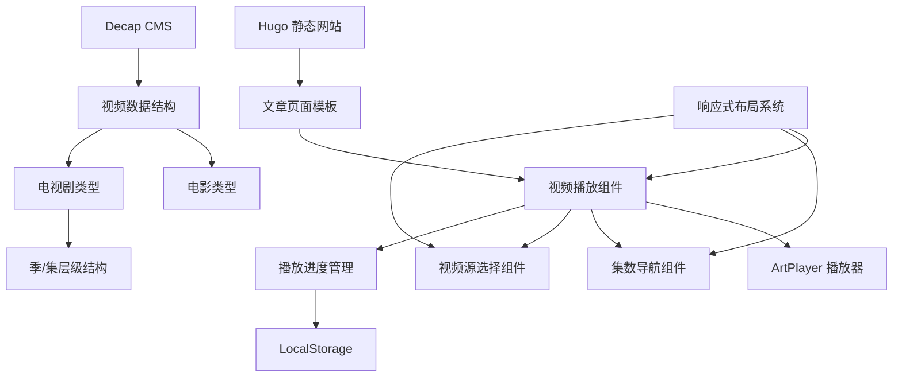

# 技术设计文档

## 概述

本设计文档描述了电影博客网站视频播放功能的增强改进方案。当前系统使用 Hugo 静态网站生成器和 ArtPlayer 视频播放器，存在多集电视剧展示混乱、视频源管理不便等问题。本次改进将实现单播放器模式、分层级集数导航、视频源下拉选择等功能，同时保持向后兼容性。

### 设计目标

- 提供清洁的单播放器界面，替代当前的瀑布式多播放器展示
- 实现直观的集数导航和视频源切换功能
- 增强 CMS 后台的视频管理能力
- 保持与现有内容的完全兼容性
- 优化移动端和桌面端的响应式体验

### 技术栈

- **前端框架**: Hugo (静态网站生成器)
- **视频播放器**: ArtPlayer v5.x
- **CMS**: Decap CMS (原 Netlify CMS)
- **样式**: CSS3 + Flexbox/Grid
- **脚本**: Vanilla JavaScript (ES6+)
- **存储**: LocalStorage (播放进度记忆)

## 架构设计

### 系统架构图



### 核心组件架构

#### 1. 视频播放系统 (VideoPlayerSystem)
- **职责**: 统一管理视频播放、集数切换、源切换
- **接口**: 提供播放控制、状态管理、事件监听
- **依赖**: ArtPlayer、LocalStorage API

#### 2. 集数导航组件 (EpisodeNavigation)
- **职责**: 展示集数卡片、处理集数切换
- **接口**: 渲染集数列表、响应用户选择
- **依赖**: 视频数据结构、CSS Grid/Flexbox

#### 3. 视频源管理组件 (VideoSourceManager)
- **职责**: 管理主源和备用源、处理源切换
- **接口**: 渲染源选择下拉菜单、切换播放源
- **依赖**: 视频播放系统

#### 4. 播放进度管理器 (PlaybackProgressManager)
- **职责**: 记录和恢复播放进度、观看状态
- **接口**: 保存/加载进度、标记观看状态
- **依赖**: LocalStorage、视频播放系统

## 组件和接口设计

### 1. 视频播放系统接口

```javascript
class VideoPlayerSystem {
  constructor(containerId, videoData, options = {}) {}
  
  // 核心播放控制
  loadVideo(episodeId, sourceId = 'primary') {}
  play() {}
  pause() {}
  
  // 集数管理
  switchEpisode(episodeId) {}
  getCurrentEpisode() {}
  getEpisodeList() {}
  
  // 视频源管理
  switchSource(sourceId) {}
  getCurrentSource() {}
  getAvailableSources() {}
  
  // 进度管理
  saveProgress() {}
  loadProgress() {}
  markAsWatched(episodeId) {}
  
  // 事件监听
  on(event, callback) {}
  off(event, callback) {}
  
  // 响应式处理
  resize() {}
  destroy() {}
}
```

### 2. 集数导航组件接口

```javascript
class EpisodeNavigation {
  constructor(container, episodes, options = {}) {}
  
  // 渲染方法
  render() {}
  renderSeasonGroup(season) {}
  renderEpisodeCard(episode) {}
  
  // 状态管理
  setActiveEpisode(episodeId) {}
  markWatchedEpisode(episodeId) {}
  
  // 事件处理
  onEpisodeClick(callback) {}
  
  // 响应式布局
  updateLayout() {}
}
```

### 3. 视频源管理接口

```javascript
class VideoSourceManager {
  constructor(container, sources, options = {}) {}
  
  // 渲染方法
  render() {}
  updateSources(sources) {}
  
  // 状态管理
  setActiveSource(sourceId) {}
  
  // 事件处理
  onSourceChange(callback) {}
}
```

## 数据模型设计

### 1. 视频数据结构

#### 电影类型 (Movie)
```yaml
videos:
  - type: movie
    label: "电影"  # 新增：自定义标签
    name: "高清源"
    url: "https://example.com/movie.m3u8"
    alternatives:
      - name: "备用源1"
        url: "https://example.com/movie-alt1.m3u8"
      - name: "备用源2"
        url: "https://example.com/movie-alt2.m3u8"
```

#### 电视剧类型 (Series)
```yaml
videos:
  - type: series
    label: "第一季"  # 新增：自定义标签
    seasons:  # 新增：季级别结构
      - season_number: 1
        season_title: "第一季"
        episodes:
          - number: "第1集"
            title: "试播集"  # 可选：集标题
            name: "高清源"
            url: "https://example.com/s01e01.m3u8"
            alternatives:
              - name: "备用源"
                url: "https://example.com/s01e01-alt.m3u8"
          - number: "第2集"
            title: "新的开始"
            name: "高清源"
            url: "https://example.com/s01e02.m3u8"
      - season_number: 2
        season_title: "第二季"
        episodes:
          - number: "第1集"
            name: "高清源"
            url: "https://example.com/s02e01.m3u8"
```

### 2. 播放进度数据结构

```javascript
// LocalStorage 中的数据结构
const progressData = {
  [articleId]: {
    currentEpisode: "s01e01",
    lastWatched: "2024-01-15T10:30:00Z",
    episodes: {
      "s01e01": {
        progress: 1800, // 秒
        duration: 3600,
        watched: true,
        lastPosition: 1800
      },
      "s01e02": {
        progress: 900,
        duration: 3600,
        watched: false,
        lastPosition: 900
      }
    }
  }
};
```

### 3. CMS 配置数据结构

#### 更新后的 Decap CMS 配置
```yaml
collections:
  - name: posts
    fields:
      # ... 现有字段 ...
      - label: 视频
        name: videos
        widget: list
        required: false
        types:
          - label: 电影
            name: movie
            widget: object
            fields:
              - label: 视频标签
                name: label
                widget: string
                required: false
                default: "电影"
                hint: "自定义显示名称，如：电影、正片、花絮等"
              - label: 主源名称
                name: name
                widget: string
                hint: "主源的显示名称"
              - label: 主源 URL
                name: url
                widget: string
              - label: 备用源
                name: alternatives
                widget: list
                required: false
                field:
                  label: 备用源
                  name: alt
                  widget: object
                  fields:
                    - label: 名称
                      name: name
                      widget: string
                    - label: URL
                      name: url
                      widget: string
          - label: 连续剧
            name: series
            widget: object
            fields:
              - label: 视频标签
                name: label
                widget: string
                required: false
                default: "连续剧"
              - label: 季
                name: seasons
                widget: list
                field:
                  label: 季
                  name: season
                  widget: object
                  fields:
                    - label: 季编号
                      name: season_number
                      widget: number
                      value_type: int
                      min: 1
                    - label: 季标题
                      name: season_title
                      widget: string
                      hint: "如：第一季、Season 1"
                    - label: 集数
                      name: episodes
                      widget: list
                      field:
                        label: 集
                        name: episode
                        widget: object
                        fields:
                          - label: 集数标识
                            name: number
                            widget: string
                            hint: "如：第1集、EP01"
                          - label: 集标题
                            name: title
                            widget: string
                            required: false
                            hint: "可选的集标题"
                          - label: 主源名称
                            name: name
                            widget: string
                          - label: 主源 URL
                            name: url
                            widget: string
                          - label: 备用源
                            name: alternatives
                            widget: list
                            required: false
                            field:
                              label: 备用源
                              name: alt
                              widget: object
                              fields:
                                - label: 名称
                                  name: name
                                  widget: string
                                - label: URL
                                  name: url
                                  widget: string
```

## 前端布局设计

### 1. 整体布局结构

```html
<div class="video-player-container">
  <!-- 视频播放器区域 -->
  <div class="video-player-wrapper">
    <div id="artplayer-container"></div>
  </div>
  
  <!-- 视频源选择区域 -->
  <div class="video-source-selector">
    <label>视频源：</label>
    <select id="source-dropdown">
      <option value="primary">高清源</option>
      <option value="alt1">备用源1</option>
    </select>
  </div>
  
  <!-- 集数导航区域 -->
  <div class="episode-navigation">
    <div class="season-group" data-season="1">
      <h3 class="season-title">第一季</h3>
      <div class="episode-cards">
        <div class="episode-card active" data-episode="s01e01">
          <span class="episode-number">第1集</span>
          <span class="episode-title">试播集</span>
          <span class="watch-status watched"></span>
        </div>
        <!-- 更多集数卡片 -->
      </div>
    </div>
  </div>
</div>
```

### 2. CSS 样式设计

```css
/* 视频播放器容器 */
.video-player-container {
  max-width: 100%;
  margin: 0 auto;
}

.video-player-wrapper {
  position: relative;
  width: 100%;
  aspect-ratio: 16/9;
  background: #000;
  border-radius: 8px;
  overflow: hidden;
}

#artplayer-container {
  width: 100%;
  height: 100%;
}

/* 视频源选择器 */
.video-source-selector {
  display: flex;
  align-items: center;
  gap: 10px;
  margin: 15px 0;
  padding: 10px;
  background: #f5f5f5;
  border-radius: 6px;
}

.video-source-selector label {
  font-weight: 500;
  color: #333;
}

#source-dropdown {
  padding: 8px 12px;
  border: 1px solid #ddd;
  border-radius: 4px;
  background: white;
  font-size: 14px;
  min-width: 120px;
}

/* 集数导航 */
.episode-navigation {
  margin-top: 20px;
}

.season-group {
  margin-bottom: 25px;
}

.season-title {
  font-size: 18px;
  font-weight: 600;
  margin-bottom: 12px;
  color: #333;
}

.episode-cards {
  display: grid;
  grid-template-columns: repeat(auto-fill, minmax(200px, 1fr));
  gap: 12px;
}

.episode-card {
  display: flex;
  flex-direction: column;
  padding: 12px;
  background: white;
  border: 2px solid #e0e0e0;
  border-radius: 8px;
  cursor: pointer;
  transition: all 0.2s ease;
  position: relative;
}

.episode-card:hover {
  border-color: #e8a020;
  box-shadow: 0 2px 8px rgba(232, 160, 32, 0.2);
}

.episode-card.active {
  border-color: #e8a020;
  background: #fff8e1;
}

.episode-number {
  font-weight: 600;
  color: #333;
  font-size: 14px;
}

.episode-title {
  font-size: 12px;
  color: #666;
  margin-top: 4px;
}

.watch-status {
  position: absolute;
  top: 8px;
  right: 8px;
  width: 8px;
  height: 8px;
  border-radius: 50%;
  background: #ddd;
}

.watch-status.watched {
  background: #4caf50;
}

/* 响应式设计 */
@media (max-width: 768px) {
  .episode-cards {
    grid-template-columns: repeat(auto-fill, minmax(150px, 1fr));
    gap: 8px;
  }
  
  .episode-card {
    padding: 10px;
  }
  
  .video-source-selector {
    flex-direction: column;
    align-items: flex-start;
    gap: 8px;
  }
  
  #source-dropdown {
    width: 100%;
  }
}

@media (max-width: 480px) {
  .episode-cards {
    display: flex;
    overflow-x: auto;
    gap: 10px;
    padding-bottom: 10px;
  }
  
  .episode-card {
    flex: 0 0 140px;
    min-width: 140px;
  }
}
```

## CMS 配置更新

### 1. 字段配置增强

#### 新增字段说明
- **视频标签 (label)**: 允许自定义视频区块的显示名称
- **季结构 (seasons)**: 支持多季电视剧的层级管理
- **集标题 (title)**: 可选的集标题，用于更详细的集数描述
- **拖拽排序**: 通过 CMS 界面支持季和集的顺序调整

#### 字段验证规则
```javascript
// CMS 自定义验证
const videoValidation = {
  url: {
    pattern: /^https?:\/\/.+\.(m3u8|mp4|webm|ogg)(\?.*)?$/,
    message: "请输入有效的视频 URL"
  },
  label: {
    maxLength: 20,
    message: "标签长度不能超过 20 个字符"
  },
  episodeNumber: {
    required: true,
    message: "集数标识不能为空"
  }
};
```

### 2. 迁移工具设计

#### 数据迁移脚本
```javascript
// 将现有 videos 结构迁移到新格式
function migrateVideoData(oldData) {
  if (!oldData.videos) return oldData;
  
  const newVideos = oldData.videos.map(video => {
    if (video.type === 'series' && video.episodes) {
      // 将旧的 episodes 结构转换为新的 seasons 结构
      return {
        ...video,
        label: video.label || "连续剧",
        seasons: [{
          season_number: 1,
          season_title: "第一季",
          episodes: video.episodes.map(ep => ({
            ...ep,
            title: ep.title || ""
          }))
        }]
      };
    }
    
    if (video.type === 'movie') {
      return {
        ...video,
        label: video.label || "电影"
      };
    }
    
    return video;
  });
  
  return {
    ...oldData,
    videos: newVideos
  };
}
```

## 向后兼容性处理

### 1. 模板兼容性

#### Hugo 模板更新策略
```html
<!-- layouts/_default/single.html 中的兼容性处理 -->
{{ with .Params.videos }}
<div class="videos-section">
  {{ range . }}
    {{ if eq .type "movie" }}
      <!-- 新的电影播放器 -->
      {{ partial "video-player/movie.html" . }}
    {{ else if eq .type "series" }}
      {{ if .seasons }}
        <!-- 新的多季电视剧播放器 -->
        {{ partial "video-player/series-new.html" . }}
      {{ else if .episodes }}
        <!-- 兼容旧的单季电视剧格式 -->
        {{ partial "video-player/series-legacy.html" . }}
      {{ end }}
    {{ end }}
  {{ end }}
</div>
{{ else }}
  <!-- 兼容旧的 iframe 嵌入方式 -->
  {{ if .Content | findRE "<iframe[^>]*player\\.html" }}
    <div class="legacy-video-notice">
      <p>检测到旧版视频格式，建议更新为新的视频播放器格式以获得更好体验。</p>
    </div>
  {{ end }}
{{ end }}
```

### 2. JavaScript 兼容性处理

```javascript
// 检测并处理不同的视频数据格式
class VideoCompatibilityHandler {
  static normalizeVideoData(videoData) {
    if (!videoData || !Array.isArray(videoData)) {
      return [];
    }
    
    return videoData.map(video => {
      // 处理旧格式的 series 类型
      if (video.type === 'series' && video.episodes && !video.seasons) {
        return {
          ...video,
          label: video.label || "连续剧",
          seasons: [{
            season_number: 1,
            season_title: video.label || "第一季",
            episodes: video.episodes
          }]
        };
      }
      
      // 处理 movie 类型
      if (video.type === 'movie') {
        return {
          ...video,
          label: video.label || "电影"
        };
      }
      
      return video;
    });
  }
  
  static detectLegacyIframe() {
    const iframes = document.querySelectorAll('iframe[src*="player.html"]');
    return iframes.length > 0;
  }
}
```

### 3. 渐进式升级策略

#### 阶段 1: 基础兼容
- 保持现有 iframe 播放器正常工作
- 新内容使用新的视频播放器系统
- 提供迁移提示和工具

#### 阶段 2: 功能增强
- 逐步将现有内容迁移到新格式
- 提供批量迁移工具
- 保留旧格式的降级支持

#### 阶段 3: 完全迁移
- 所有内容使用新的播放器系统
- 移除旧格式的兼容代码
- 优化性能和用户体验

## 响应式布局方案

### 1. 断点设计

```css
/* 响应式断点定义 */
:root {
  --breakpoint-mobile: 480px;
  --breakpoint-tablet: 768px;
  --breakpoint-desktop: 1024px;
  --breakpoint-large: 1200px;
}
```

### 2. 移动端优化

#### 播放器适配
```css
/* 移动端播放器优化 */
@media (max-width: 768px) {
  .video-player-wrapper {
    margin: 0 -15px; /* 突破容器边距，实现全宽显示 */
    border-radius: 0;
  }
  
  /* 确保播放器控制栏在移动端易于操作 */
  .art-controls {
    padding: 10px 15px;
  }
  
  .art-control {
    min-height: 44px; /* 符合移动端触摸标准 */
  }
}
```

#### 集数导航移动端布局
```css
@media (max-width: 480px) {
  .episode-navigation {
    margin: 15px -15px 0; /* 全宽显示 */
    padding: 0 15px;
  }
  
  .episode-cards {
    display: flex;
    overflow-x: auto;
    scroll-snap-type: x mandatory;
    gap: 10px;
    padding: 10px 0;
    
    /* 隐藏滚动条但保持功能 */
    scrollbar-width: none;
    -ms-overflow-style: none;
  }
  
  .episode-cards::-webkit-scrollbar {
    display: none;
  }
  
  .episode-card {
    flex: 0 0 140px;
    scroll-snap-align: start;
  }
  
  /* 添加滚动指示器 */
  .episode-cards::after {
    content: '';
    flex: 0 0 10px;
  }
}
```

### 3. 平板端适配

```css
@media (min-width: 481px) and (max-width: 768px) {
  .episode-cards {
    grid-template-columns: repeat(auto-fill, minmax(180px, 1fr));
  }
  
  .video-source-selector {
    padding: 12px 15px;
  }
}
```

### 4. 桌面端优化

```css
@media (min-width: 1024px) {
  .video-player-container {
    max-width: 900px;
  }
  
  .episode-cards {
    grid-template-columns: repeat(auto-fill, minmax(220px, 1fr));
  }
  
  /* 桌面端悬停效果增强 */
  .episode-card:hover {
    transform: translateY(-2px);
    box-shadow: 0 4px 12px rgba(232, 160, 32, 0.3);
  }
}
```

## 性能优化方案

### 1. 懒加载策略

```javascript
// 集数卡片懒加载
class EpisodeLazyLoader {
  constructor() {
    this.observer = new IntersectionObserver(
      this.handleIntersection.bind(this),
      { threshold: 0.1 }
    );
  }
  
  observe(elements) {
    elements.forEach(el => this.observer.observe(el));
  }
  
  handleIntersection(entries) {
    entries.forEach(entry => {
      if (entry.isIntersecting) {
        this.loadEpisodeData(entry.target);
        this.observer.unobserve(entry.target);
      }
    });
  }
  
  loadEpisodeData(element) {
    // 加载集数的缩略图、时长等额外信息
    const episodeId = element.dataset.episode;
    // 实现具体的数据加载逻辑
  }
}
```

### 2. 视频预加载优化

```javascript
// 智能预加载下一集
class VideoPreloader {
  constructor(videoPlayer) {
    this.player = videoPlayer;
    this.preloadedSources = new Map();
  }
  
  preloadNext(currentEpisode) {
    const nextEpisode = this.getNextEpisode(currentEpisode);
    if (nextEpisode && !this.preloadedSources.has(nextEpisode.id)) {
      this.preloadVideo(nextEpisode.url);
    }
  }
  
  preloadVideo(url) {
    // 创建隐藏的 video 元素进行预加载
    const video = document.createElement('video');
    video.preload = 'metadata';
    video.src = url;
    video.style.display = 'none';
    document.body.appendChild(video);
    
    // 预加载完成后移除元素
    video.addEventListener('loadedmetadata', () => {
      document.body.removeChild(video);
    });
  }
}
```

### 3. 缓存策略

```javascript
// 播放进度和设置缓存
class VideoCache {
  static CACHE_PREFIX = 'video_player_';
  static CACHE_EXPIRY = 7 * 24 * 60 * 60 * 1000; // 7天
  
  static set(key, data) {
    const cacheData = {
      data,
      timestamp: Date.now(),
      expiry: Date.now() + this.CACHE_EXPIRY
    };
    
    try {
      localStorage.setItem(
        this.CACHE_PREFIX + key,
        JSON.stringify(cacheData)
      );
    } catch (e) {
      console.warn('缓存存储失败:', e);
    }
  }
  
  static get(key) {
    try {
      const cached = localStorage.getItem(this.CACHE_PREFIX + key);
      if (!cached) return null;
      
      const cacheData = JSON.parse(cached);
      if (Date.now() > cacheData.expiry) {
        this.remove(key);
        return null;
      }
      
      return cacheData.data;
    } catch (e) {
      console.warn('缓存读取失败:', e);
      return null;
    }
  }
  
  static remove(key) {
    localStorage.removeItem(this.CACHE_PREFIX + key);
  }
  
  static clear() {
    Object.keys(localStorage)
      .filter(key => key.startsWith(this.CACHE_PREFIX))
      .forEach(key => localStorage.removeItem(key));
  }
}
```

## 错误处理策略

### 1. 视频加载错误处理

```javascript
class VideoErrorHandler {
  constructor(videoPlayer) {
    this.player = videoPlayer;
    this.retryCount = 0;
    this.maxRetries = 3;
  }
  
  handleVideoError(error) {
    console.error('视频播放错误:', error);
    
    switch (error.code) {
      case 1: // MEDIA_ERR_ABORTED
        this.showError('视频播放被中断');
        break;
      case 2: // MEDIA_ERR_NETWORK
        this.handleNetworkError();
        break;
      case 3: // MEDIA_ERR_DECODE
        this.showError('视频解码失败，请尝试其他视频源');
        break;
      case 4: // MEDIA_ERR_SRC_NOT_SUPPORTED
        this.handleUnsupportedFormat();
        break;
      default:
        this.showError('视频播放出现未知错误');
    }
  }
  
  handleNetworkError() {
    if (this.retryCount < this.maxRetries) {
      this.retryCount++;
      setTimeout(() => {
        this.player.reload();
      }, 2000 * this.retryCount);
      
      this.showError(`网络错误，正在重试 (${this.retryCount}/${this.maxRetries})`);
    } else {
      this.showError('网络连接失败，请检查网络或尝试其他视频源');
      this.suggestAlternativeSources();
    }
  }
  
  handleUnsupportedFormat() {
    this.showError('当前浏览器不支持此视频格式');
    this.suggestAlternativeSources();
  }
  
  suggestAlternativeSources() {
    const alternatives = this.player.getAvailableSources();
    if (alternatives.length > 1) {
      this.showAlternativeSourcesDialog(alternatives);
    }
  }
  
  showError(message) {
    // 在播放器界面显示错误信息
    const errorOverlay = document.createElement('div');
    errorOverlay.className = 'video-error-overlay';
    errorOverlay.innerHTML = `
      <div class="error-content">
        <i class="error-icon">⚠️</i>
        <p class="error-message">${message}</p>
        <button class="retry-btn" onclick="location.reload()">刷新页面</button>
      </div>
    `;
    
    this.player.container.appendChild(errorOverlay);
  }
}
```

### 2. 网络状态监控

```javascript
class NetworkMonitor {
  constructor(videoPlayer) {
    this.player = videoPlayer;
    this.isOnline = navigator.onLine;
    this.setupEventListeners();
  }
  
  setupEventListeners() {
    window.addEventListener('online', () => {
      this.isOnline = true;
      this.handleOnline();
    });
    
    window.addEventListener('offline', () => {
      this.isOnline = false;
      this.handleOffline();
    });
  }
  
  handleOnline() {
    // 网络恢复时自动重试播放
    if (this.player.hasError()) {
      this.player.retry();
    }
  }
  
  handleOffline() {
    // 网络断开时暂停播放并显示提示
    this.player.pause();
    this.showOfflineNotice();
  }
  
  showOfflineNotice() {
    // 显示离线提示
  }
}
```

## 测试策略

### 1. 单元测试

```javascript
// 视频播放器核心功能测试
describe('VideoPlayerSystem', () => {
  let player;
  
  beforeEach(() => {
    player = new VideoPlayerSystem('test-container', mockVideoData);
  });
  
  test('应该正确加载视频', () => {
    player.loadVideo('s01e01');
    expect(player.getCurrentEpisode()).toBe('s01e01');
  });
  
  test('应该正确切换集数', () => {
    player.switchEpisode('s01e02');
    expect(player.getCurrentEpisode()).toBe('s01e02');
  });
  
  test('应该正确切换视频源', () => {
    player.switchSource('alt1');
    expect(player.getCurrentSource()).toBe('alt1');
  });
  
  test('应该正确保存播放进度', () => {
    player.saveProgress();
    const progress = VideoCache.get('progress_test-article');
    expect(progress).toBeDefined();
  });
});
```

### 2. 集成测试

```javascript
// 端到端功能测试
describe('视频播放器集成测试', () => {
  test('完整的观看流程', async () => {
    // 1. 页面加载
    await page.goto('/posts/test-series/');
    
    // 2. 播放器初始化
    await page.waitForSelector('.video-player-container');
    
    // 3. 播放视频
    await page.click('.art-play');
    
    // 4. 切换集数
    await page.click('[data-episode="s01e02"]');
    
    // 5. 切换视频源
    await page.selectOption('#source-dropdown', 'alt1');
    
    // 6. 验证状态
    const currentEpisode = await page.getAttribute('.episode-card.active', 'data-episode');
    expect(currentEpisode).toBe('s01e02');
  });
});
```

### 3. 性能测试

```javascript
// 性能基准测试
describe('性能测试', () => {
  test('播放器初始化时间', async () => {
    const startTime = performance.now();
    
    const player = new VideoPlayerSystem('container', largeVideoData);
    await player.initialize();
    
    const initTime = performance.now() - startTime;
    expect(initTime).toBeLessThan(1000); // 1秒内完成初始化
  });
  
  test('集数切换响应时间', async () => {
    const player = new VideoPlayerSystem('container', videoData);
    await player.initialize();
    
    const startTime = performance.now();
    await player.switchEpisode('s01e10');
    const switchTime = performance.now() - startTime;
    
    expect(switchTime).toBeLessThan(500); // 500ms内完成切换
  });
});
```

## 部署和维护

### 1. 部署清单

#### 文件更新清单
- `layouts/_default/single.html` - 模板更新
- `layouts/partials/video-player/` - 新增播放器组件
- `assets/js/video-player-enhanced.js` - 新的播放器脚本
- `assets/css/video-player.css` - 播放器样式
- `static/admin/config.yml` - CMS 配置更新

#### 配置检查
- [ ] ArtPlayer CDN 链接正常
- [ ] HLS.js 库加载正常
- [ ] LocalStorage 权限正常
- [ ] 响应式断点测试通过
- [ ] 各浏览器兼容性测试通过

### 2. 监控和维护

#### 性能监控指标
```javascript
// 关键性能指标监控
const performanceMetrics = {
  playerInitTime: 0,
  videoLoadTime: 0,
  episodeSwitchTime: 0,
  errorRate: 0,
  userEngagement: {
    averageWatchTime: 0,
    episodeCompletionRate: 0,
    sourceSwithRate: 0
  }
};

// 错误监控
window.addEventListener('error', (event) => {
  if (event.filename.includes('video-player')) {
    // 发送错误报告到监控系统
    sendErrorReport({
      message: event.message,
      filename: event.filename,
      lineno: event.lineno,
      userAgent: navigator.userAgent,
      timestamp: new Date().toISOString()
    });
  }
});
```

#### 维护任务
- **每周**: 检查视频链接有效性
- **每月**: 分析用户观看数据，优化推荐算法
- **每季度**: 更新 ArtPlayer 和依赖库版本
- **按需**: 根据用户反馈调整界面和功能

### 3. 版本升级策略

#### 渐进式升级路径
1. **v1.0**: 基础单播放器模式和集数导航
2. **v1.1**: 播放进度记忆和观看状态
3. **v1.2**: 高级功能（字幕、播放速度记忆等）
4. **v2.0**: AI 推荐和个性化功能

#### 向后兼容保证
- 保持 API 接口稳定性
- 提供数据迁移工具
- 维护旧版本的降级支持
- 详细的升级文档和指南

---

## 总结

本技术设计文档详细描述了视频播放器增强功能的完整实现方案，包括：

1. **系统架构**: 模块化设计，清晰的组件职责分离
2. **用户界面**: 响应式布局，优秀的移动端体验
3. **数据管理**: 灵活的视频数据结构，完善的进度管理
4. **性能优化**: 懒加载、缓存、预加载等优化策略
5. **错误处理**: 全面的错误处理和恢复机制
6. **兼容性**: 完整的向后兼容性保证

该设计方案能够满足所有需求，提供优秀的用户体验，同时保持系统的可维护性和可扩展性。
## 正确性属性

*属性是在系统的所有有效执行中都应该成立的特征或行为——本质上是关于系统应该做什么的正式陈述。属性作为人类可读规范和机器可验证正确性保证之间的桥梁。*

### 属性反思

在分析所有可测试的验收标准后，我识别出以下可以合并的冗余属性：

**合并的属性组：**
- 属性 1.3 和 1.4 可以合并为一个关于标签显示逻辑的综合属性
- 属性 3.4 和 3.5 可以合并为一个关于集数卡片显示内容和状态的属性
- 属性 4.4 和 4.5 可以合并为一个关于视频源下拉菜单显示的属性
- 属性 6.1 和 6.3 可以合并为一个关于播放进度存储的综合属性
- 属性 7.1 和 7.2 可以合并为一个关于移动端布局优化的属性

### 属性 1：视频标签自定义和显示

*对于任何* 视频条目，当管理员设置自定义视频标签时，系统应该保存该标签并在界面中显示；当未设置自定义标签时，应该显示默认的"视频"标签

**验证需求：1.1, 1.3, 1.4**

### 属性 2：视频标签输入验证

*对于任何* 视频标签输入，系统应该只接受中文、英文和数字字符，且长度在 1-20 个字符范围内的输入

**验证需求：1.5**

### 属性 3：单播放器模式

*对于任何* 包含视频内容的文章页面，系统应该只显示一个 ArtPlayer 播放器窗口，不再使用瀑布式多播放器显示模式

**验证需求：2.1, 2.3**

### 属性 4：多集内容默认加载

*对于任何* 包含多集内容的文章，视频播放系统应该默认加载并显示第一集的内容

**验证需求：2.2**

### 属性 5：播放器功能特性保持

*对于任何* 新的单播放器模式，应该保持与当前播放器相同的所有功能特性（全屏、画中画、播放速度控制等）

**验证需求：2.4**

### 属性 6：播放器错误处理

*对于任何* 播放器加载失败的情况，系统应该显示友好的错误提示信息

**验证需求：2.5**

### 属性 7：集数导航区域显示

*对于任何* 包含多集内容的视频，系统应该在播放器下方显示集数导航区域

**验证需求：3.1**

### 属性 8：多季内容分组显示

*对于任何* 包含多个季的视频内容，集数卡片应该按季进行分组显示

**验证需求：3.2**

### 属性 9：集数切换功能

*对于任何* 集数卡片的点击操作，视频播放系统应该切换播放器内容到对应的集数

**验证需求：3.3**

### 属性 10：集数卡片信息显示和状态标识

*对于任何* 集数卡片，应该显示集数标识和集名称（如有），并通过视觉样式区分当前播放集和其他集数

**验证需求：3.4, 3.5**

### 属性 11：集数卡片响应式布局

*对于任何* 设备屏幕尺寸，集数卡片应该提供适合的响应式布局

**验证需求：3.6**

### 属性 12：视频源下拉菜单位置

*对于任何* 视频播放器，系统应该在播放器下方第一栏位置显示视频源选择下拉菜单

**验证需求：4.1**

### 属性 13：视频源列表完整性

*对于任何* 当前播放的集数，视频源下拉菜单应该列出该集数的所有可用主源和备用源

**验证需求：4.2**

### 属性 14：视频源切换功能

*对于任何* 视频源的选择操作，视频播放系统应该切换播放器到新选择的视频 URL

**验证需求：4.3**

### 属性 15：视频源下拉菜单显示和标记

*对于任何* 视频源下拉菜单，应该显示每个视频源的名称，并标记当前正在播放的视频源

**验证需求：4.4, 4.5**

### 属性 16：单一视频源处理

*对于任何* 只有一个视频源的集数，视频源下拉菜单仍然应该显示，但只包含该单一选项

**验证需求：4.6**

### 属性 17：CMS 多季支持

*对于任何* 文章，CMS 应该支持添加多个季的视频内容

**验证需求：5.1**

### 属性 18：CMS 季标识设置

*对于任何* 季，CMS 应该允许设置自定义的季标识

**验证需求：5.2**

### 属性 19：CMS 集数信息设置

*对于任何* 集数，CMS 应该支持设置集数标识和可选的集名称

**验证需求：5.3**

### 属性 20：CMS 备用源配置

*对于任何* 集数，CMS 应该允许配置多个备用视频源

**验证需求：5.4**

### 属性 21：CMS 拖拽排序功能

*对于任何* 季和集数，CMS 应该提供拖拽排序功能来调整显示顺序

**验证需求：5.5**

### 属性 22：CMS URL 格式验证

*对于任何* 视频 URL 输入，CMS 应该在保存时验证 URL 格式的有效性

**验证需求：5.6**

### 属性 23：播放进度本地存储

*对于任何* 文章的观看活动，视频播放系统应该使用浏览器本地存储记录观看进度和每集的播放时间进度

**验证需求：6.1, 6.3**

### 属性 24：观看状态恢复

*对于任何* 重新访问的文章，视频播放系统应该自动加载上次观看的集数

**验证需求：6.2**

### 属性 25：观看完成标识

*对于任何* 已观看完成的集数，集数卡片应该显示"已观看"标识

**验证需求：6.4**

### 属性 26：观看记录重置功能

*对于任何* 视频播放系统，应该提供"重置观看记录"选项供用户清除进度

**验证需求：6.5**

### 属性 27：移动端集数卡片布局优化

*对于任何* 移动端设备（屏幕宽度 ≤ 768px），集数卡片应该采用横向滚动方式展示，避免占用过多垂直空间

**验证需求：7.1, 7.2**

### 属性 28：移动端下拉菜单尺寸

*对于任何* 移动端设备，视频源下拉菜单应该保持易于点击的尺寸（最小 44px 高度）

**验证需求：7.3**

### 属性 29：播放器宽高比保持

*对于任何* 设备，视频播放器应该保持 16:9 的宽高比

**验证需求：7.4**

### 属性 30：播放器尺寸自适应

*对于任何* 屏幕宽度小于播放器最小宽度的情况，视频播放系统应该自动调整播放器尺寸

**验证需求：7.5**

### 属性 31：iframe 嵌入兼容性

*对于任何* 现有的单视频 iframe 嵌入方式，视频播放系统应该继续支持

**验证需求：8.1**

### 属性 32：旧格式自动适配

*对于任何* 使用旧视频格式的文章，视频播放系统应该自动适配为单播放器模式

**验证需求：8.2**

### 属性 33：现有数据结构兼容性

*对于任何* 现有的 videos 字段结构（movie 和 series 类型），视频播放系统应该继续支持

**验证需求：8.3**

### 属性 34：新旧格式优先级

*对于任何* 同时包含新旧视频格式的文章，视频播放系统应该优先使用新格式

**验证需求：8.4**

### 属性 35：CMS 迁移工具

*对于任何* 现有文章，CMS 应该提供迁移工具帮助管理员将其转换为新的视频格式

**验证需求：8.5**

## 错误处理

### 视频播放错误处理

系统应该能够优雅地处理各种视频播放错误：

- **网络错误**: 自动重试机制，最多重试 3 次，每次间隔递增
- **格式不支持**: 提示用户尝试其他视频源，自动显示备用源选项
- **解码错误**: 显示明确的错误信息，建议用户更新浏览器或尝试其他源
- **源不可用**: 自动切换到可用的备用源，记录错误日志

### 数据验证错误处理

- **URL 格式验证**: 实时验证视频 URL 格式，提供即时反馈
- **字符长度验证**: 对视频标签等输入进行长度和字符类型验证
- **必填字段验证**: 确保关键字段不为空，提供清晰的错误提示

### 兼容性错误处理

- **旧格式解析**: 当遇到无法解析的旧格式时，提供降级支持
- **浏览器兼容性**: 检测浏览器功能支持，提供相应的功能降级
- **存储限制**: 处理 LocalStorage 存储限制，实现智能清理机制

## 测试策略

### 双重测试方法

本项目将采用单元测试和基于属性的测试相结合的方法：

**单元测试**：
- 验证具体的示例和边界情况
- 测试组件间的集成点
- 验证错误条件和异常处理
- 测试特定的用户交互场景

**基于属性的测试**：
- 验证跨所有输入的通用属性
- 通过随机化实现全面的输入覆盖
- 测试系统在各种条件下的行为一致性
- 验证数据完整性和状态转换

### 基于属性的测试配置

**测试库选择**: 使用 fast-check (JavaScript) 进行基于属性的测试

**测试配置**:
- 每个属性测试最少运行 100 次迭代
- 每个测试必须引用其对应的设计文档属性
- 标签格式: **Feature: video-player-enhancement, Property {number}: {property_text}**

**示例属性测试**:

```javascript
// 属性 1: 视频标签自定义和显示
fc.assert(fc.property(
  fc.record({
    customLabel: fc.option(fc.string({ minLength: 1, maxLength: 20 })),
    videoEntry: fc.record({ type: fc.constantFrom('movie', 'series') })
  }),
  (data) => {
    const displayLabel = getVideoLabel(data.videoEntry, data.customLabel);
    if (data.customLabel) {
      return displayLabel === data.customLabel;
    } else {
      return displayLabel === "视频";
    }
  }
), { numRuns: 100 });
// Feature: video-player-enhancement, Property 1: 视频标签自定义和显示

// 属性 9: 集数切换功能
fc.assert(fc.property(
  fc.record({
    episodes: fc.array(fc.record({
      id: fc.string(),
      url: fc.webUrl()
    }), { minLength: 2 }),
    targetEpisodeIndex: fc.nat()
  }),
  (data) => {
    const targetIndex = data.targetEpisodeIndex % data.episodes.length;
    const targetEpisode = data.episodes[targetIndex];
    
    const player = new VideoPlayerSystem('test', data.episodes);
    player.switchEpisode(targetEpisode.id);
    
    return player.getCurrentEpisode() === targetEpisode.id;
  }
), { numRuns: 100 });
// Feature: video-player-enhancement, Property 9: 集数切换功能
```

### 单元测试重点

单元测试将专注于：
- CMS 表单验证逻辑
- 视频播放器初始化和配置
- 响应式布局断点测试
- 错误处理和恢复机制
- 数据迁移和兼容性处理
- 用户交互的具体场景（点击、拖拽等）

### 集成测试

- 端到端的用户工作流测试
- 跨浏览器兼容性测试
- 移动端和桌面端响应式测试
- 性能基准测试
- 可访问性合规测试

通过这种综合的测试策略，我们确保视频播放器增强功能在各种条件下都能可靠工作，同时保持良好的用户体验和系统性能。